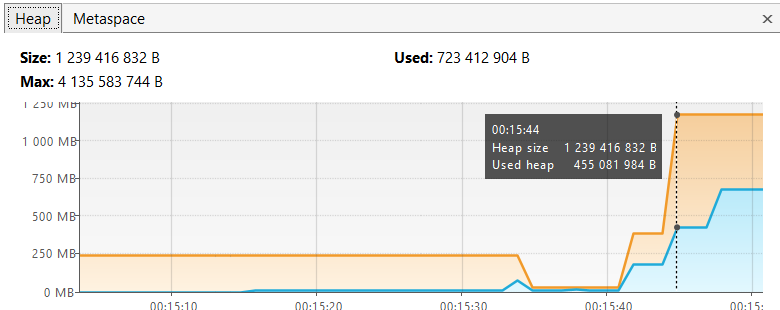

1. 

    Соответствует строчке в консоли: 00:15:30.643618200: loaded 529 classes  
    ClassLoader загрузил в метаспейс 529 классов из io.vertx
2.

    Соответствует строчке в консоли: 00:15:34.445146500: loaded 2117 classes  
    ClassLoader загрузил в метаспейс 2117 классов из io.netty
3.

    Соответствует строчке в консоли: 00:15:37.710355300: loaded 869 classes  
    ClassLoader загрузил в метаспейс 869 классов из org.springframework
4.

    Соответствует строчке в консоли: 00:15:40.713573: creating 5000000 objects  
    В кучу добавлено 5000000 объектов
5.

    Соответствует строчке в консоли: 00:15:42.931868200: creating 5000000 objects  
    В кучу добавлено 5000000 объектов
6.

    Соответствует строчке в консоли: 00:15:4.157962500: creating 5000000 objects  
    В кучу добавлено 5000000 объектов